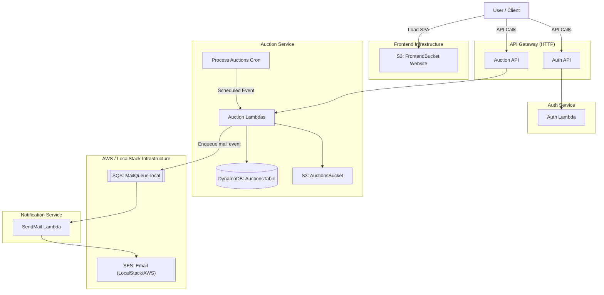

# 🛠️ Serverless Auction Platform

A **capstone project** built using **AWS**, following a **microservices architecture** with an **event-driven**, **serverless (FaaS)** design. This platform enables scalable, modular, and resilient online auctions using the [Serverless Framework](https://www.serverless.com/) deployed on AWS cloud services.

---

## 🏗️ High-Level Architecture



---

## 🧱 Architecture Overview

- **Architecture Style**: Microservices
- **Execution Model**: Serverless (FaaS - Function as a Service)
- **Design Pattern**: Event-Driven
- **Cloud Platform**: AWS
- **Use Case**: Capstone project demonstrating best practices in cloud-native application development

Each microservice is independently deployable and communicates via AWS-managed messaging and notification services, following the principles of loose coupling and asynchronous processing.

---

## 🚀 Tech Stack

- **Language**: Node.js
- **Framework**: Serverless Framework
- **Cloud Services**:
  - AWS Lambda (FaaS)
  - API Gateway
  - DynamoDB
  - SQS (Simple Queue Service)
  - SES (Simple Email Service)
  - CloudWatch (Monitoring)
- **Authentication**: JWT + Lambda Authorizer
- **CI/CD**: GitHub Actions _(planned)_
- **Local Development**: LocalStack, Serverless Offline, Docker

---

## 📁 Project Structure

```bash
serverless-auction-platform/
│
├── auction-service/        # Handles listing, bidding, and auction state transitions
├── auth-service/           # Manages user authentication and authorization via JWT
├── notification-service/   # Sends email notifications via SES/SNS
├── scripts/                # Helper scripts for local dev and testing
├── docker-compose.yml      # LocalStack configuration
└── README.md               # Project documentation
```

---

## 📦 Features

### ✅ Auction Service

- Create, update, and delete auctions
- Start and end auctions with scheduled events
- Accept bids with validation and conflict handling
- Trigger notifications and events for auction outcomes

### 🔐 Auth Service

- User sign-up and login with email verification
- JWT token generation and validation
- Lambda Authorizer integration for securing API endpoints

### 📢 Notification Service

- Send notifications for auction events
- Inform winning bidders and auction owners
- Uses AWS SES and SNS for delivery

---

## 🔧 Setup Instructions

### Prerequisites

- **Node.js** (v20.x recommended)
- **Docker** & **Docker Compose**
- **AWS CLI** (v2)
- **Serverless Framework** (v3)

### 1. Installation

Install dependencies for the root and all services:

```bash
# Root dependencies
npm install

# Service dependencies
cd auction-service && npm install && cd ..
cd auth-service && npm install && cd ..
cd notification-service && npm install && cd ..
```

### 2. Configure Dummy Credentials (LocalStack)

Configure AWS CLI to use dummy credentials for local testing (region `us-east-1` is preferred):

```bash
aws configure set aws_access_key_id test
aws configure set aws_secret_access_key test
aws configure set region us-east-1
```

---

## ⚙️ Usage (Local Development & Testing)

> **Tip**: On Windows, use **PowerShell** for `npm` commands and **Git Bash** for `bash` scripts / `curl` examples.

### 🔹 Quick Start (Local)

```bash
# 1. Install dependencies
npm install && cd auction-service && npm install && cd ..

# 2. Start LocalStack
npm run local:up

# 3. Start Auction API
npm run offline:auction
```

---

### 1. Start LocalStack

Use the provided script to start LocalStack and bootstrap required resources (DynamoDB tables, SQS queues, S3 buckets, SES identities):

```bash
npm run local:up
```

> **Note**: This runs `docker compose up` and executes `scripts/localstack-bootstrap.sh`. You should see `[Bootstrap] Done.` with no errors.

### 2. Run Services Locally

You can run each service in **separate terminal windows** using `serverless-offline`.

**Auction Service** (Port 3000):

```bash
npm run offline:auction
```

**Auth Service** (Port 3000 - _conflict warning_):

> _Note: By default, serverless-offline uses port 3000. If you run multiple services, override ports with `--httpPort` or only run the Auction Service when running tests._

```bash
npm run offline:auth
```

**Notification Service** (Port 3000 - _conflict warning_):

```bash
npm run offline:notify
```

### 3. Automated Tests (Docker)

To run the full suite of **Smoke Tests** and **E2E Tests** in a clean Docker environment:

```bash
npm run test:compose
```

> For the E2E tests, only the **Auction Service** needs to be running via `npm run offline:auction`. Auth and Notification are mocked or exercised indirectly via LocalStack.

This command:

1. Starts the Auction Service in the background.
2. Builds a test container (`tester`).
3. Runs `scripts/test-local.sh` (resource verification) and `scripts/test-e2e.sh` (API flows) against the local setup.

### 4. Manual Verification

You can manually trigger flows using `curl` or the provided helper script.

**Helper Script**:

```bash
# Requires 'jq' to be installed
bash scripts/verify-local-flow.sh
```

**Manual Commands**:

_Create an Auction:_

```bash
curl -X POST http://localhost:3000/auction \
  -H "Content-Type: application/json" \
  -d '{"title": "Test Auction"}'
```

_Place a Bid:_

```bash
# Replace {id} with the ID from the previous step
curl -X PATCH http://localhost:3000/auction/{id}/bid \
  -H "Content-Type: application/json" \
  -d '{"amount": 100}'
```

_Trigger Scheduled Process (Close Auctions):_
Since `serverless-offline` doesn't automatically trigger scheduled events, invoke the lambda manually:

```bash
aws --endpoint-url=http://localhost:3002 lambda invoke \
  --function-name auction-service-local-processAuctions \
  --payload '{}' \
  response.json
```

_(Note: Port `3002` is used here assuming `serverless-offline` exposes Lambda RPC. If not, use the LocalStack endpoint `http://localhost:4566` if deployed there. This simulates the scheduled `processAuctions` function that would normally be triggered by CloudWatch Events in AWS.)_

### 🌐 Frontend Deployment on LocalStack (S3 Website)

You can deploy the frontend into LocalStack’s S3 website hosting for a fully local end-to-end experience.

#### 1. Build & Deploy Frontend

```bash
# From repo root
npm run local:up              # if not already running
npm run deploy:frontend:local
```

This will:

* Build the frontend app (e.g. in `frontend/out`)
* Sync the static files to the `auction-frontend-local` S3 bucket in LocalStack

#### 2. Access the Frontend

Try:

```bash
curl http://localhost:4566/auction-frontend-local/index.html
```

Or open the equivalent URL in your browser.

**Using the Web Interface:**

The deployed frontend is a Single Page Application (SPA) that allows you to interact with the backend services directly.

1.  **Ensure Services are Running:**
    *   LocalStack: `npm run local:up`
    *   Auction Service: `npm run offline:auction` (Runs on port 3000)

2.  **Open the Page:**
    Navigate to `http://localhost:4566/auction-frontend-local/index.html` in your browser.

3.  **Interact:**
    *   **Login:** Enter any email/password (simulated for local dev) to authenticate.
    *   **Create Auction:** Enter a title and click "Create Auction". The new ID will be auto-filled.
    *   **Bid:** Enter an amount and click "Place Bid".
    *   **View:** Click "Get Auction Details" to see the current state (e.g., highest bid).

*(Note: URL style may differ slightly depending on your LocalStack version; in some setups you can also use bucket-style hostnames.)*

### 🧪 Frontend Verification with Playwright

We include a Python-based Playwright test suite to verify the frontend UI flows.

#### Prerequisites
- Python 3.x
- Playwright (`pip install playwright` + `playwright install`)

#### Running Tests

1. **Mocked Backend (Default)**
   This runs the tests using network interception (mocks), so you don't need the backend running.
   ```bash
   npm run test:frontend
   ```

2. **Real Backend (E2E)**
   To run against the real local backend (ensure `npm run offline:auction` is running):
   ```bash
   export REAL_BACKEND=true
   npm run test:frontend
   ```

### ☁️ Full LocalStack Deployment (Real Lambdas)

For a more authentic simulation, you can deploy the backend services as actual Lambda functions inside LocalStack, instead of running them locally via `serverless-offline`.

1. **Start LocalStack & Bootstrap**
   ```bash
   npm run local:up
   ```

2. **Deploy Backend Services**
   This packages and deploys all services to LocalStack:
   ```bash
   npm run deploy:local:all
   ```

3. **Deploy Frontend**
   This builds the frontend and configures it to talk to the deployed LocalStack APIs:
   ```bash
   npm run deploy:frontend:local
   ```

4. **Access the App**
   Open the S3 website URL (hosted by LocalStack):
   ```bash
   # Prints the URL content
   curl http://localhost:4566/auction-frontend-local/index.html | head
   ```
   Or visit `http://localhost:4566/auction-frontend-local/index.html` in your browser.

   The frontend will automatically use the LocalStack API Gateway endpoints (e.g. `http://localhost:4566/restapis/...`).

---

## 🏗️ Deployment (AWS)

**Important**: Before deploying, ensure you have configured valid AWS credentials. You may need to unset the dummy credentials used for LocalStack:

```bash
# Verify identity (should NOT be 'test')
aws sts get-caller-identity
```

To deploy to real AWS environment:

```bash
# Deploy Auction Service
cd auction-service
sls deploy --stage dev

# Deploy Auth Service
cd ../auth-service
sls deploy --stage dev

# Deploy Notification Service
cd ../notification-service
sls deploy --stage dev
```

---

## 👨‍💻 Author

**Harshana Lakshara**
GitHub: [@UchihaIthachi](https://github.com/UchihaIthachi)

---

## 🪪 License

This project is licensed under the [MIT License](LICENSE).
